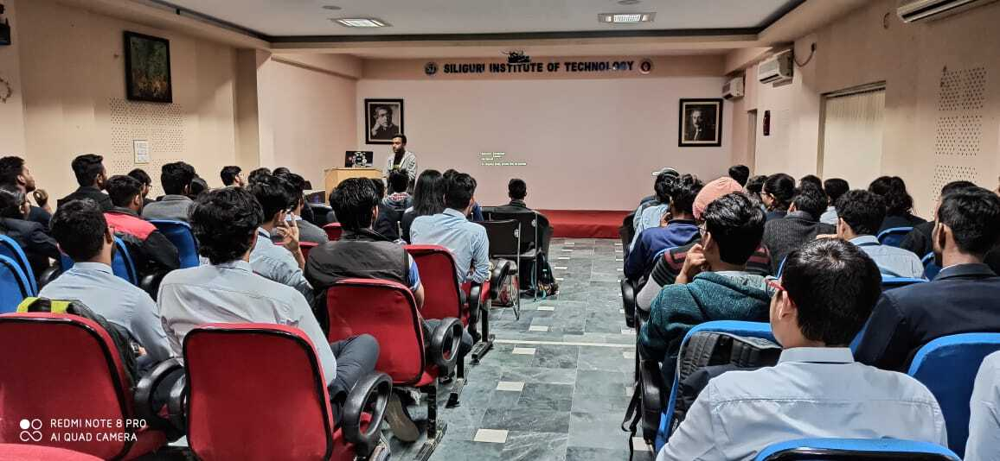
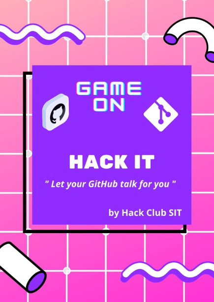

 

## Introduction to Hack Club:

It is an incident from the previous year (2019), One day I was going through my emails and I found one email from GitHub. When I scrolled through the email there was a link to a post about Hack Club. I didn’t know anything about the Hack Club. Then I read about it and was motivated to apply as a lead. So filled that form and it took about 2 hours to fill that form.

Then I took two of my friends Nilavya Das and Ishan Bagchi as the Co-lead. I was very nervous as I have never been a leader of any group before and if my application was rejected then it that too would be very painful for me.

But my luck shined and I got one email from Hack Club that said they have selected my proposal and now there would be one interview round. I was scared as I didn’t have any experience of giving an interview. But as the interviewer was very friendly and helpful so it went great for me.

He asked me some questions about my ideas and how I would teach other members and after giving answers he told me that I have to organize our first meetup.

## First events - Open Source and GitHub:

Now, we were going to conduct our first meetup. In the first session, I told everyone about the Hack Club and its mission. After that, I took one session on Git and GitHub. As it was my first event I was a little bit nervous but in the end, all the things went well!

After that, we met another day for GitHub and Open Source again. This time I was fully ready to take that the event and teach all the basic topics and open source concepts. This time we were going blazing fast and all the members were very eager to learn and build projects.

## The Pandemic Story

We had many plans to execute after the first two events, but then the pandemic happened and we were unable to execute any of our plans. Other groups and people were affected by the pandemic, our Hack Club SIT was no exception to that. We lost all our connections with other members. The group was in very bad condition. No members were active and we also didn’t have anything to do at that time. At that point, I thought that club might not sustain.

## We made it through!

After some months at the end of August, I and my co-leads had one idea. We thought to take a one-month long competition on open-source contribution.

We then started with the execution of our plans. We made and collectively took some projects from people and told the creators to make some issues in their projects. After that, all the 27 contributors started to make their contribution. Some of them made decent contributions and we gave them some stickers. This event was pretty long but well-executed.

At that point in time, we thought maybe if we take online sessions we can also create a better impact.

## New Beginnings

Some days later, my juniors came to me and told me that they were going to be active and they wanted to learn and improve their skills. I was so happy to see their eagerness to learn and make something good. So we made one core team to plan our events and other tasks.

Then we found that many students didn’t know what were the different things in computer science engineering. So we took one event with 6 speakers( specialists in different fields) about what is engineering and what are the different parts of it. In this event, we talk about web development, app development, artificial intelligence, cybersecurity, and competitive programming.

As Hack Club gave us Zoom pro. We were using it to take this event. We got an amazing response from the attendees. We also have one youtube channel.

<iframe src='https://www.youtube.com/embed/qjctMXhyQNk' frameborder='0' allow="accelerometer; autoplay; clipboard-write; encrypted-media; gyroscope; picture-in-picture"  allowfullscreen>
</iframe>

 

## Conclusion

Now, I know regardless of the ups and downs Hack Club SIT will be able to sustain itself and will continue to have the impact that it has now!
